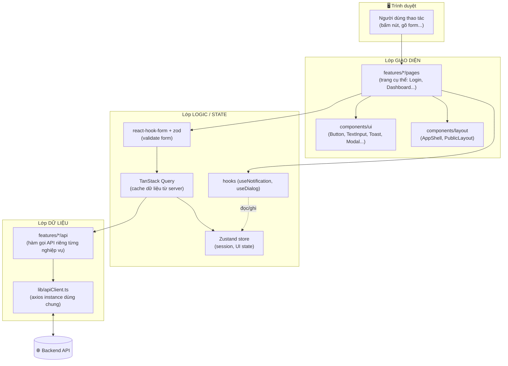
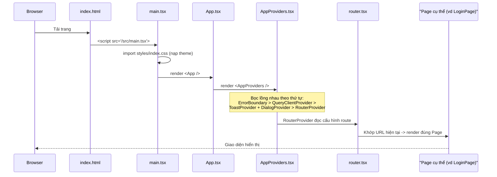
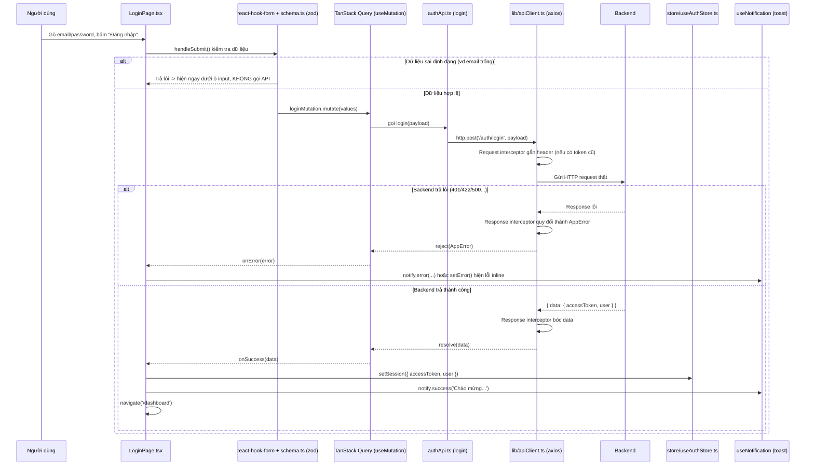
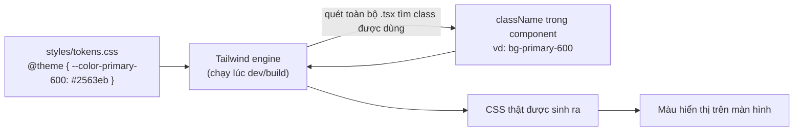
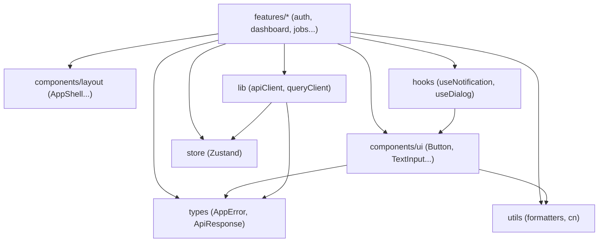

# HireWise Frontend — Package & File Interaction (dành cho người mới)

Tài liệu này KHÔNG dạy lại cách dùng từng thứ (đã có trong
[`GUIDE.md`](./GUIDE.md)). Tài liệu này trả lời câu hỏi: **"cái package/file
này dùng để làm gì, và khi app chạy thì các file gọi nhau theo thứ tự
nào?"** — để bạn đọc code mà không bị lạc.

> Đọc theo thứ tự: Mục 1 (bức tranh toàn cảnh) → Mục 2 (từng package làm gì)
> → Mục 3 (app khởi động ra sao) → Mục 4 (ví dụ thực tế: bấm nút Đăng nhập
> thì chuyện gì xảy ra) → Mục 5 (theme liên hệ với component thế nào) →
> Mục 6 (quy tắc ai được phép import ai).

---

## 1. Bức tranh toàn cảnh

Một ứng dụng React không phải "1 file to" — nó là nhiều lớp (layer) xếp
chồng, mỗi lớp lo một việc. HireWise chia thành các lớp sau, từ ngoài
(người dùng nhìn thấy) vào trong (dữ liệu thô):

**Nguyên tắc dòng chảy:** dữ liệu và hành động luôn đi **Giao diện → Logic →
Dữ liệu → Backend**, rồi kết quả đi ngược lại. Component ở lớp Giao diện
**không bao giờ** gọi thẳng `axios`/`fetch` — luôn đi qua `features/*/api` rồi
`lib/apiClient.ts`. Đây là lý do khi cần đổi cách gọi API (vd thêm header
mới), bạn chỉ sửa 1 file (`apiClient.ts`) thay vì lục tung cả app.

---

## 2. Từng package trong `package.json` dùng để làm gì?

### Nhóm "app chạy cần nó" (`dependencies`) — có mặt trong bundle production

| Package                 | Vai trò (nói theo cách dễ hiểu)                                                                 | Thấy rõ nhất ở file nào                       |
| ------------------------ | -------------------------------------------------------------------------------------------------- | ------------------------------------------------ |
| `react`, `react-dom`      | Bộ lõi React — biến code JSX (`
...
`) thành giao diện thật trên trình duyệt.               | Mọi file `.tsx`                                    |
| `react-router-dom`        | Định tuyến URL — quyết định gõ `/login` thì hiện trang nào, `/dashboard` thì hiện trang nào.         | `src/app/router.tsx`, `constants/routes.ts`        |
| `@tanstack/react-query`   | "Quản gia" cho dữ liệu lấy từ server: tự cache, tự loading/error, tự gọi lại khi cần. Không có nó, bạn phải tự viết `useState` + `useEffect` cho MỌI api call. | `src/lib/queryClient.ts`, mọi `useQuery`/`useMutation` |
| `zustand`                 | Kho lưu trạng thái dùng chung toàn app (vd: ai đang đăng nhập) mà không cần truyền props qua nhiều tầng component. | `src/store/useAuthStore.ts`                        |
| `axios`                   | Thư viện gửi request HTTP tới backend, mạnh hơn `fetch` gốc nhờ có "interceptor" (chặn request/response để xử lý chung). | `src/lib/apiClient.ts`                             |
| `react-hook-form`         | Quản lý state của form (giá trị đang gõ, đã đụng vào field chưa, có lỗi không) mà không làm app chậm. | Mọi form, vd `LoginPage.tsx`                       |
| `zod`                     | Định nghĩa "luật hợp lệ" cho dữ liệu (vd: email phải đúng định dạng) — dùng để validate form.        | `src/features/*/schema.ts`                          |
| `@hookform/resolvers`     | Miếng nối để `react-hook-form` hiểu và dùng được luật validate viết bằng `zod`.                        | Chỗ khai báo `useForm({ resolver: zodResolver(schema) })` |
| `dayjs`                   | Xử lý ngày/giờ (định dạng, tính khoảng cách, "5 phút trước"...).                                     | `src/utils/formatters/date.ts`                       |
| `tailwindcss`, `@tailwindcss/vite` | Sinh CSS từ class name (`bg-primary-600`, `p-4`...) thay vì tự viết file `.css` tay.        | `src/styles/tokens.css`, class trong mọi `.tsx`      |
| `clsx`                    | Ghép nhiều class CSS lại có điều kiện (vd: "nếu đang active thì thêm class này").                     | `src/utils/cn.ts`                                    |
| `tailwind-merge`          | Dọn dẹp xung đột khi 2 class Tailwind cùng ảnh hưởng 1 thuộc tính (vd `px-4` và `px-2` cùng lúc) — giữ lại class đúng ý. | `src/utils/cn.ts`                                    |
| `@phosphor-icons/react`   | Bộ icon (biểu tượng) dùng thống nhất toàn app — thay vì tự vẽ SVG tay.                                 | Mọi nơi có `<Icon />`, vd `AppShell.tsx`               |

### Nhóm "chỉ dev mới cần" (`devDependencies`) — KHÔNG có trong bundle production, chỉ hỗ trợ lúc code

| Package                                            | Vai trò                                                                                     |
| ---------------------------------------------------- | ----------------------------------------------------------------------------------------------- |
| `vite`, `@vitejs/plugin-react`                        | Công cụ build — biến code TypeScript/JSX thành file JS/CSS thật, có server dev tốc độ cao (HMR: sửa code là thấy ngay không cần reload trang). |
| `typescript`                                          | Thêm kiểu dữ liệu (type) cho JavaScript, giúp bắt lỗi (vd gõ nhầm tên field) ngay khi code thay vì đợi chạy mới lỗi. |
| `eslint`, `@eslint/js`, `typescript-eslint`, `eslint-plugin-react-hooks`, `eslint-plugin-react-refresh`, `globals` | Bộ máy kiểm tra chất lượng code tự động (vd: dùng hook sai chỗ, khai báo biến không dùng...). Chạy bằng `npm run lint`. |
| `prettier`, `prettier-plugin-tailwindcss`, `eslint-config-prettier` | Tự động format code cho đồng nhất (thụt lề, dấu nháy, xuống dòng...) kể cả tự sắp xếp thứ tự class Tailwind. Chạy bằng `npm run format`. |
| `@types/react`, `@types/react-dom`, `@types/node`     | File khai báo kiểu dữ liệu cho các thư viện không viết sẵn bằng TypeScript, để TypeScript "hiểu" chúng. |
| `@tanstack/react-query-devtools`                       | Bảng debug (chỉ hiện lúc `npm run dev`) cho phép xem TanStack Query đang cache gì, đang loading gì. |

**Ghi nhớ:** nếu thấy 1 package trong `devDependencies`, nó KHÔNG bao giờ
chạy trên máy người dùng cuối — chỉ giúp bạn (lập trình viên) code nhanh
hơn, sạch hơn.

---

## 3. Ứng dụng khởi động theo trình tự nào?

Khi mở `http://localhost:5173`, các file được gọi theo đúng thứ tự sau:

Giải thích từng bước bằng lời:

1. **`index.html`** — file HTML gốc duy nhất (SPA: Single Page Application),
   chỉ có 1 thẻ `
` trống và 1 thẻ `<script>` nạp `main.tsx`.
2. **`main.tsx`** — điểm vào (entry point) của code React. Việc đầu tiên nó
   làm là `import '@/styles/index.css'` (nạp toàn bộ theme/design token vào
   trang), sau đó "gắn" component `<App />` vào thẻ `#root`.
3. **`App.tsx`** — cực kỳ mỏng, chỉ render `<AppProviders />`. Tách riêng để
   sau này dễ thêm test hoặc wrapper khác mà không đụng vào cấu hình provider.
4. **`app/AppProviders.tsx`** — nơi "lắp ráp" mọi thứ toàn cục, bọc lồng
   nhau theo ĐÚNG thứ tự (thứ tự này quan trọng, xem mục 6):
   - `ErrorBoundary` (ngoài cùng — bắt được lỗi của mọi lớp bên trong)
   - `QueryClientProvider` (để `useQuery`/`useMutation` dùng được ở mọi trang)
   - `ToastProvider` + `DialogProvider` (để `useNotification`/`useDialog`
     dùng được ở mọi trang)
   - `RouterProvider` (trong cùng — quyết định trang nào hiện ra)
5. **`app/router.tsx`** — bảng tra cứu "URL nào ↔ Page nào", chia 2 nhánh:
   `PublicLayout` (không cần đăng nhập) và `ProtectedRoute > AppShell` (bắt
   buộc đăng nhập). Xem chi tiết ở `GUIDE.md` mục 8.
6. **Page cụ thể** (vd `features/auth/pages/LoginPage.tsx`) — mới thực sự
   chứa giao diện và logic nghiệp vụ mà người dùng nhìn thấy.

---

## 4. Ví dụ thực tế: bấm nút "Đăng nhập" thì chuyện gì xảy ra?

Đây là ví dụ CỤ THỂ NHẤT để hiểu các lớp ở Mục 1 nói chuyện với nhau ra sao —
toàn bộ code thật nằm trong `features/auth/`.

**Vì sao thiết kế theo kiểu tách lớp thế này?** Nếu sau này backend đổi từ
`/auth/login` sang endpoint khác, hoặc đổi format lỗi trả về — bạn chỉ sửa
`authApi.ts` hoặc `apiClient.ts`. `LoginPage.tsx` (phần giao diện) hầu như
không cần đụng tới.

---

## 5. Design Token liên hệ với component như thế nào?

Bạn **không** cần "import" file `tokens.css` vào từng component — nó được
nạp 1 lần duy nhất ở `main.tsx` (qua `styles/index.css`). Component chỉ cần
viết đúng tên class (`bg-primary-600`, `rounded-md`...); Tailwind tự động
quét toàn bộ file `.tsx` trong lúc build, thấy class nào đang được dùng thì
sinh CSS cho đúng class đó dựa trên giá trị khai báo trong `tokens.css`.

---

## 6. Ai được phép import ai? (tránh phụ thuộc vòng / phá kiến trúc)

**Quy tắc 1 chiều:** mũi tên chỉ đi từ `features/*` (nghiệp vụ cụ thể) VÀO
các lớp nền tảng (`components/ui`, `hooks`, `lib`, `store`, `utils`,
`types`) — **không bao giờ đi ngược lại**. Nghĩa là:

- ✅ `features/auth/pages/LoginPage.tsx` được import `components/ui/Button`.
- ❌ `components/ui/Button.tsx` **không được** import bất cứ thứ gì từ
  `features/auth/...` — nếu Button cần biết về "auth", nghĩa là logic đó
  đang đặt sai chỗ (nên đưa lên `hooks/` hoặc để nguyên trong `features/auth`
  và không lôi Button phụ thuộc vào nó).

Vi phạm quy tắc này là dấu hiệu sớm nhất cho thấy kiến trúc đang "rối" —
nếu thấy mình sắp import ngược, dừng lại và hỏi: component này có nên nằm
trong `features/` thay vì `components/ui/` không?

---

## 7. Câu hỏi thường gặp

**Q: File này không có trong tài liệu, tôi tìm hiểu ở đâu?**
Mọi file đều có comment `/** ... */` ở đầu giải thích nó dùng để làm gì và
tại sao viết như vậy — đọc trực tiếp trong code trước, tài liệu chỉ tóm tắt
bức tranh lớn.

**Q: Tôi muốn thêm 1 package mới, có được tự thêm không?**
Không tự thêm package lớn (thư viện UI khác, state management khác...) mà
không trao đổi với team trước — xem lý do ở `GUIDE.md` mục 1. Package nhỏ,
không tranh chấp vai trò với package đã có (vd thêm 1 icon còn thiếu) thì có
thể thêm thoải mái.
